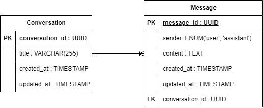
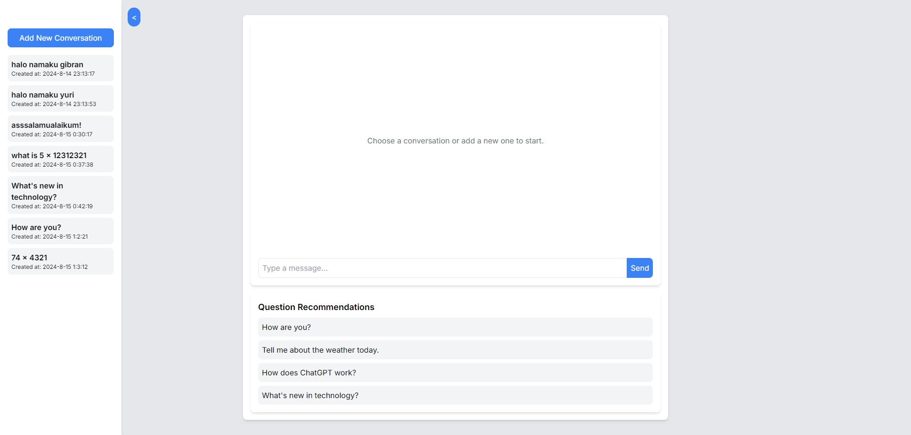
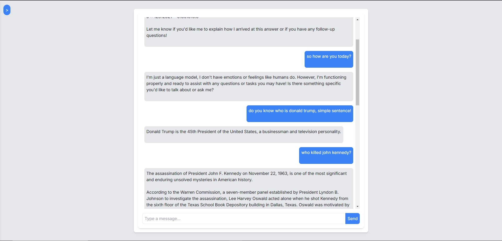
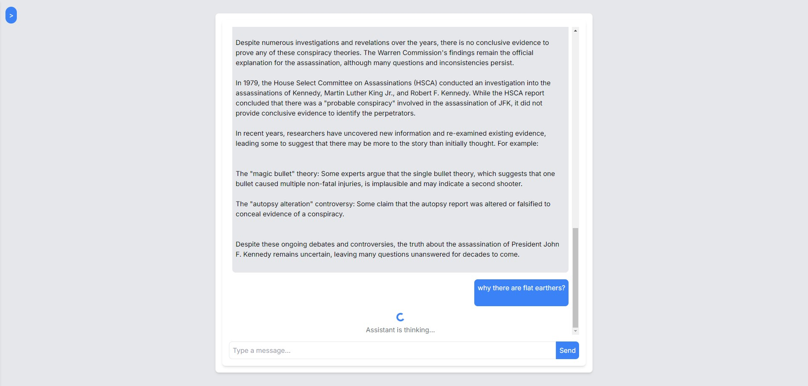

# <h1 align="center"> ✨ ChatEase - Intelligent Conversational Assistant ✨ <h4 align="center"> by Gibran Fasha Ghazanfar 💫</h4> </h1>

## Overview

This project, **ChatEase**, is a web-based intelligent conversational assistant designed to provide seamless interaction with users. The assistant leverages the power of Ollama with the Meta Llama3 model to generate accurate and context-aware responses. This project was developed as part of the **Study Case MSIB Batch 7 - Telkom Indonesia**.

## Features Implemented

- Real-time chatbot interface using llama3 (8b) model.
- Conversation and message history.
- Message recommendations to start a conversation.
- User-friendly interface with a clean and responsive design.

## Prerequisites

- [Composer](https://getcomposer.org/) (>= v2)
- [Node.js](https://nodejs.org/en) (>= v20)
- [Ollama](https://ollama.com/docs/overview) (v0.3.6)

## Tech Stack

### Frontend

- [Next.js](https://nextjs.org/docs) (v14.2.5)
- [TypeScript](https://www.typescriptlang.org/docs/) (v5)
- [Tailwind CSS](https://tailwindcss.com/docs) (v3.4.1)

### Backend

- [Laravel](https://laravel.com/docs) (v11.x)
- [PHP](https://www.php.net/docs.php) (>= v8.2)
- [MySQL](https://dev.mysql.com/doc/) (>= v8)

### LLM

- [Meta llama3](https://ollama.com/docs/overview) (8b)

### Packages

- [Marked](https://github.com/markedjs/marked) (latest version): A Markdown parser and compiler.

## Tools Used

- [Visual Studio Code](https://code.visualstudio.com/): Code editor used for development.
- [Git](https://git-scm.com/): Version control system.
- [Laragon](https://laragon.org/): Local development environment for PHP, including:
  - [HeidiSQL](https://www.heidisql.com/): Database management tool.
  - [Apache](https://httpd.apache.org/): Web server.
  - [MySQL](https://dev.mysql.com/downloads/mysql/): Relational database management system.
- [Postman](https://www.postman.com/): API client for testing and developing APIs.

## Branching

- `main` is the main branch that will be used for deployment (production)

## Commit Message Convention (Semantic)

- `feat`: (new feature for the user, not a new feature for build script)
- `fix`: (bug fix for the user, not a fix to a build script)
- `docs`: (changes to the documentation)
- `style`: (formatting, missing semi colons, etc; no production code change)
- `refactor`: (refactoring production code, eg. renaming a variable)
- `test`: (adding missing tests, refactoring tests; no production code change)
- `chore`: (updating grunt tasks etc; no production code change)

## How to Run Locally

### Frontend

1. Clone this repository (branch `main`) if you haven't already.
2. Navigate to the `client` folder.
3. Open the project folder in Visual Studio Code (`code .` in CLI).
4. Open the terminal and run `npm install`.
5. Run `npm run dev`.
6. Open your browser and go to `localhost:3000`.

### Backend

1. Clone this repository (branch `main`) if you haven't already.
2. Navigate to the `server` folder.
3. Open the project folder in Visual Studio Code (`code .` in CLI).
4. Copy .env.example to .env and fill in the necessary environment variables.
5. Open the terminal and run `composer install`.
6. Run `php artisan migrate`.
7. Run `php artisan serve`.
8. Open your browser and go to `localhost:8000`.

### AI (LLM)

1. If Ollama is already installed and not yet running also llama3 (8b) model has been downloaded, open a new terminal in cmd.
2. Execute `ollama serve` and it should be accessible at `localhost:11434`.

## Database Design

## Application Screenshots

### Default Page

### Conversation Selected Page

### Ask Assistant Process Page

## Demo Video Recording

[Google Drive](https://drive.google.com/drive/folders/110xD9doHclpg5A88b0D_RLJJU0d0Mc9i?usp=sharing)

## How to Contribute

1. Fork this repository to your GitHub account.
2. Clone the forked repository to your local machine.
3. Create a new branch corresponding to the feature you want to work on or the bug you want to fix.
4. Commit and push your changes to that branch (make sure not to make changes directly to the `main` branch).
5. Create a pull request to the `main` branch of this repository.
6. Wait for the reviewer to review and merge your pull request.
7. If the reviewer requests changes, make the requested changes, commit, and push them to the same branch, then notify the reviewer that the changes have been made.
8. Once your pull request is approved, it will be merged into the `main` branch, and the branch you created will be deleted (to avoid unused branches).

Feel free to contribute to this project by fixing existing bugs, adding new features, or improving documentation. Happy coding 🎉!

## Note

For this project, I am prioritizing the role of Backend Engineer. However, I am also very interested in and excited about Fullstack Engineering. If possible, I would love to work on both frontend and backend tasks to leverage my skills across the entire stack.

## Author

- Gibran Fasha Ghazanfar - [LinkedIn](https://www.linkedin.com/in/gibran-fasha-ghazanfar-22035319b/)
